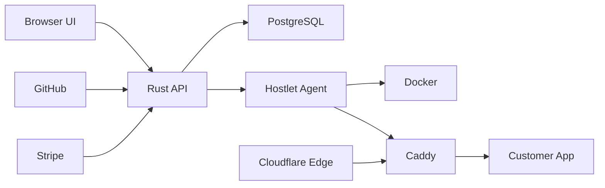

# Hostlet 0.4.0 Threat Model

## Executive Summary

Hostlet 0.4.0 is a private hosted cloud beta plus a self-hosted control plane. The highest-risk areas are cloud tenant isolation, provider webhook trust, API-to-agent job integrity, and the privileged agent/Docker/Caddy boundary. The current release hardens cloud request context, GitHub App install state, Stripe subscription activation, loopback app port binding, Caddy route rollback, and Compose validation, but pre-tag manual review should still focus on the paths below.

## Scope And Assumptions

In scope:

- Runtime API, auth, billing, GitHub, deploy, and agent paths in `apps/api/src`.
- Local deployment agent and runtime controls in `apps/agent/src/main.rs`.
- Cloud/self-host Docker Compose and Caddy configs in `infra/`.
- Cloud account/billing schema in `apps/api/migrations/021_cloud_accounts.sql`.

Out of scope:

- Third-party provider internals for GitHub, Stripe, Cloudflare, Docker, and Caddy.
- Historical `0.3.x` release docs except where they influence current claims.
- Live production validation, because local secrets were inspected only for presence and not exposed.

Assumptions:

- `hostlet.cloud` is internet-exposed and multi-tenant, but still a private beta.
- Stripe remains in sandbox for 0.4.0.
- Cloud MVP supports single-service apps only; cloud Compose and custom domains are deferred.
- The local agent is host-trusted because it has Docker socket access.
- Shane is the sole maintainer; sensitive-code bus factor 1 is expected but must be offset by focused review.

Open questions that could change risk ranking:

- Whether `hostlet.cloud` has network firewall rules that block direct access to Docker-published ephemeral ports.
- Whether GitHub App org installs are expected for first users or only personal-account installs.
- Whether Stripe webhook delivery is monitored outside application logs.

## System Model

### Primary Components

- Browser UI: Next.js app in `apps/web`, calling API routes under `NEXT_PUBLIC_API_URL`.
- Rust API: Axum routes declared in `apps/api/src/main.rs`; handles sessions, cloud auth, billing, app CRUD, deploys, logs, webhooks, and agent APIs.
- PostgreSQL: persistent app, deployment, cloud account, session, webhook, and job state, including `cloud_sessions`, `cloud_subscriptions`, and `agent_jobs`.
- Hostlet agent: Rust worker in `apps/agent/src/main.rs`; claims jobs, clones/builds repos, runs Docker containers, manages Caddy route snippets, probes health, and reports events.
- Caddy/cloudflared: route public control-plane and app traffic to API/web/app containers via `infra/Caddyfile.*` and Compose services.
- External providers: GitHub OAuth/App/webhooks, Stripe Checkout/Portal/webhooks, Cloudflare DNS/Tunnel.

### Data Flows And Trust Boundaries

- Internet browser -> API over HTTP(S): session cookies, JSON bodies, app settings, env-var names, deployment actions. Controls: signed cookies and cloud session binding in `auth::request_context`, origin checks in `main::requires_browser_origin`, security headers in `main::security_headers`, and route-level authorization in `web.rs` and `deploy.rs`.
- GitHub -> API webhook over HTTPS: push payloads and delivery IDs. Controls: provider HMAC signature in `github::webhook`, dedupe in `webhook_events`, and branch/repo matching before deployment.
- Stripe -> API webhook over HTTPS: billing events. Controls: `valid_stripe_signature`, timestamp tolerance, event dedupe in `cloud_webhook_events`, and subscription state handling in `handle_subscription_event`.
- API -> GitHub/Stripe/Cloudflare over HTTPS: OAuth tokens, installation tokens, billing/customer requests, DNS requests. Controls: provider APIs, server-side secrets in `AppState`, and safe browser error messages.
- API -> agent over WebSocket/HTTP: signed job payloads, agent token, logs/events. Controls: `x-hostlet-agent-token`, per-server job signing, `agent::claim_job`, `agent::complete_job`, and lease renewal through `job_status`.
- Agent -> Docker/Caddy/host filesystem: repo code, build commands, env vars, Docker socket, Caddy snippets. Controls: Hostlet-managed names, loopback port publishing via `docker_port_map`, Compose subset validation, Caddy route restore on reload failure, and secret redaction in command/log helpers.
- Customer app -> platform network/runtime: app HTTP traffic and environment variables. Controls: no direct worker tokens in app payloads, loopback upstreams, and managed `/data` volume naming.

#### Diagram

## Assets And Security Objectives

- Cloud sessions and legacy app sessions: prevent account takeover and tenant mixups.
- GitHub OAuth/App credentials and installation IDs: prevent repo access abuse and installation reassignment.
- Stripe customer/subscription state: prevent unpaid compute and billing-state spoofing.
- App env vars and deployment logs: prevent cross-tenant disclosure and accidental secret leaks.
- Agent token and job signing secret: prevent unauthorized host-level job execution.
- Docker socket, Caddy snippets, and app containers: preserve host integrity and routing correctness.
- Cloudflare tokens and DNS records: prevent domain takeover or stale public exposure.
- Release artifacts and docs: avoid shipping stale metadata or secrets.

## Attacker Model

Capabilities:

- Remote unauthenticated users can reach public API/UI routes and provider webhook endpoints.
- Authenticated cloud users can create supported apps, provide repo/app metadata, set env vars, and trigger deployments within plan gates.
- GitHub/Stripe webhook senders control provider payload fields but must pass provider signature checks.
- Customer repo code runs inside app containers and may be malicious from the platform perspective.

Non-capabilities:

- Attackers cannot read local secret files, unless the host, agent, or app isolation fails.
- Attackers cannot directly write PostgreSQL without an API, provider webhook, or agent path bug.
- Customer apps should not possess worker tokens, Stripe secrets, GitHub App private keys, or queue access.

## Prioritized Threats

| Priority | Threat | Likelihood | Impact | Existing Controls | Gaps / Review Focus |
| --- | --- | --- | --- | --- | --- |
| High | Cross-tenant app/job/log access through legacy `users.id` without bound `cloud_users.id`. | Medium: many handlers are customer-scoped and cloud uses two identity tables. | High: tenant data/control compromise. | Shared `request_context` in `auth.rs`; customer routes in `web.rs`, `deploy.rs`, and `github.rs` now require it. | Add integration tests with two cloud users, revoked cloud sessions, jobs, logs, and env-var reads. |
| High | Unpaid or GitHub-uninstalled user obtains compute by bypassing billing/install gates. | Medium: deploy, retry, health, restart, and env mutations are multiple paths. | High: cost abuse and platform misuse. | `cloud_compute_allowed_for_context`, subscription entitlements, pending-only checkout completion, GitHub install checks. | Add DB-backed tests for inactive subscriptions, missing installations, checkout-only pending state, and subscription deletion. |
| High | Agent/Docker/Caddy boundary abused for host control or stale route activation. | Medium: agent runs Docker and writes Caddy snippets. | High: host compromise or traffic misrouting. | Signed jobs, agent token, loopback app ports, Caddy route restore on failed reload, managed container names. | Manually review all subprocess calls, env injection, route file paths, and Docker socket exposure before tag. |
| Medium | Provider webhook replay or spoof changes billing/deploy state. | Low to medium: provider signatures are required; replay was the main risk. | High for billing or deployment integrity. | Stripe signature + timestamp tolerance + dedupe; GitHub signature + delivery dedupe. | Add end-to-end webhook tests for duplicate events, missing metadata, subscription deletion, branch deletes, and invalid signatures. |
| Medium | Malicious Compose app escapes intended runtime shape. | Medium for self-hosted users who enable Compose. | Medium to high depending host policy. | Compose cloud-disabled, self-host Compose rejects ports, networks, bind mounts, privileged fields, and invalid services. | Continue fuzzing long syntax and less-common Compose keys; document unsupported rollback and `/data` behavior. |
| Medium | Secrets leak through logs, browser bundles, docs, or release artifacts. | Medium: app env vars and provider errors cross many paths. | High if provider or agent secrets leak. | Secret redaction tests in agent; safe provider errors; plan requires no raw secret output. | Add pre-tag artifact scan and web bundle check; inspect `dist/` before release. |

## Mitigations And Recommendations

- Add DB-backed API tests for cloud auth gates and tenant isolation. Target `apps/api/src/auth.rs`, `apps/api/src/web.rs`, `apps/api/src/deploy.rs`, and `apps/api/src/github.rs`.
- Add Stripe webhook tests for duplicate events, missing metadata, checkout completion, subscription update/cancel/delete, stale signatures, and invalid signatures.
- Add agent tests that simulate Caddy reload failure and assert previous route restoration.
- Add release gate checks for `dist/`, browser bundles, docs, and logs to prevent raw secret or stale version artifacts.
- Document that the agent is host-trusted and that Docker socket access is equivalent to host control.
- Confirm network firewall behavior for loopback-only app ports in production Compose and Proxmox/host firewall policy.

## Focus Paths For Manual Review

- `apps/api/src/auth.rs`: session binding, GitHub OAuth/App state, cloud installation ownership, billing/install gates.
- `apps/api/src/web.rs`: cloud app CRUD, billing webhooks, env vars, job visibility/mutation, entitlement enforcement.
- `apps/api/src/deploy.rs`: deployment/rollback authorization, job payload construction, cloud deploy gates.
- `apps/api/src/github.rs`: GitHub webhook trust, repo inspection, App installation token usage.
- `apps/api/src/agent.rs`: agent authentication, job claim/complete, event ingestion, log/resource writes.
- `apps/api/src/crypto.rs`: token hashing, encryption, HMAC helpers.
- `apps/api/migrations/021_cloud_accounts.sql`: cloud tenant, session, subscription, and webhook schema.
- `apps/agent/src/main.rs`: Docker/Caddy subprocess calls, Compose validation, route updates, secret redaction.
- `infra/docker-compose.yml`: dev service exposure and tunnel profile behavior.
- `infra/docker-compose.prod.yml`: production bind addresses, Docker socket, Caddy/cloudflared topology.
- `apps/web`: browser error rendering, public env vars, source maps, and mode-specific controls.

## Quality Check

- Entry points covered: browser API routes, websockets, GitHub webhooks, Stripe webhooks, agent APIs, Docker/Caddy runtime actions.
- Trust boundaries covered: browser/API, provider/API, API/database, API/agent, agent/Docker, Caddy/app, Cloudflare/Caddy.
- Runtime vs dev separated: dev cloudflared profile and production Compose are called out separately.
- Assumptions explicit: private cloud beta, sandbox Stripe, single-service cloud MVP, host-trusted local agent.
- Open questions listed: firewall posture, GitHub org install expectations, Stripe webhook monitoring.
